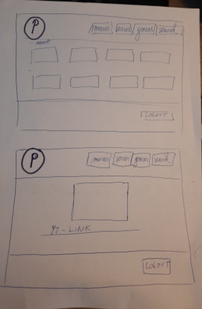

### Welcome to the webpage of The Theatre !

# Who

Our Project Team consists of

- [@Lord-of-Chicken](https://github.com/Lord-of-Chicken)
- [@gonzalovsilva](https://github.com/gonzalovsilva)
- [@robbertklockaerts](https://github.com/robbertklockaerts)
- [@Yuliya-beCode](https://github.com/Yuliya-beCode)

### Tasks allocation

| Gonçalo Silva| Gael Layeux | Robbert Klockaerts |  Yuliya Bochkovskaya|
|:-----------:|:-----------:|:-----------:| :-----------:|   
| Creation of the video catalog / debag comments part  | A session system: registration, connection / disconnection / comments rights | Right to comment on the content | General administration of the project/Figma style |  
| Include a search bar and sort by filters| php footer/header include | Admin dashboard | php insert video and info into info.php / draft info.php |
| Page or section that displays the top movies with the movie db API| Back office for user and comment management (CRUD) | Login form css / 404-Page |  Footer/header templates, merging css in one file|
| General administration of the project drafting search flow chart| General administration of the project | General administration of the project|  Register form css / README|

If you have any questions in regards to our project, please do not hesitate to contact us directly on GitHub. Our
contact details are mentioned above.

# What

The Theatre is a streaming website created in html / css, javascript and php.

* We got inspired by Netflix, Amazon Prime Video and other Popcorn Time ... Our goal was to display a catalog of movies.

* We well spotted the similarities between these platforms (navbar, header, search tool, different categories of
  videos…)

Please find here below our very first sketches and UX prototype of our website which has been created at the planning stage the
Theatre :-)

[First UX-Prototype of our website](https://www.figma.com/proto/LZLTLgveLvyu8aBJbc3u1G/The-Theater?node-id=66%3A0&scaling=scale-down&page-id=0%3A1)

# How

- To setup this development environment you will need to have **docker** and
  **docker-compose** installed on you system.

- The Theatre Website includes a search bar and sort by filters, which have been developed in accordance with the
  flowchart attached below.

- The filter function of the Theatre displays the top movies. This function is enabled with the movie db API. This
  product uses the TMDb API.

- Our movie streaming website has the session system: registration, connection / disconnection. It also includes an
  Admin Dashboard which allows to keep under control upocoming visitors of the website.

- Registrants of the Theatre have the right to comment on the movies.

- Back office of the Theatre for user and comment management (CRUD) is also available.

# Why

Creating the video streaming website is an excellent task to bring together all the knowledge acquired so far. During
this task we used use php, js, css, Docker, bootstrap and tested our skills in group work. We also used the TMDb API,
which is an important part of the video streaming websites.

Today is a time of movie streaming websites. Netflix, Amazon Prime Video, Disney HotStar are making much more money than
the theatres themselves. They stream not only movies but also web series, documentaries, etc. This means that the
streaming websites should guarantee a large working area for Wep Developers in the future.

The first commercial streaming product appeared in late 1992 and was named StarWorks. StarWorks enabled on-demand MPEG-1
full-motion videos to be randomly accessed on corporate Ethernet networks. Starworks was from Starlight Networks, who
also pioneered live video streaming on Ethernet and via Internet Protocol over satellites with Hughes Network Systems.
The first commercial streaming product appeared in late 1992 and was named StarWorks. StarWorks enabled on-demand MPEG-1
full-motion videos to be randomly accessed on corporate Ethernet networks. Starworks was from Starlight Networks, who
also pioneered live video streaming on Ethernet and via Internet Protocol over satellites with Hughes Network Systems. (source: Wikipedia)

# When

**29/03/21**

- Meet
- Reading & discussing deliverables
- Distribution of roles
- Manufacturing of the first prototype in Figma
- A session system: connection / disconnection
- Search filter categories

**30/03/21**

- Meet
- Installation of Docker
- Drafting search flow chart
- Preparation of design basis html files
- A session system: connection / disconnection
- Search filter categories

**31/03/21**

- Meet
- Work on allowing categorization of TOP 10, genres, etc.
- A session system: connection / disconnection
- Creation of Admin Dashboard
- Design welcome & registration form

**01/04/21**

- Meet
- Work on allowing categorization of TOP 10, genres, etc.
- Registrants have the right to enter the admin/users dashboard
- Work on the Figma UX
- Check responsive style

**02/04/21**

- Meet
- Work on allowing categorization of TOP 10, genres, etc.
- Registrants have the right to enter the admin/users dashboard
- Preparation of html page info.html for sorting the upcoming videos and video details
- Work on database
- Work on css styles

**06/04/21**

- Meet
- Research to the "methode GET"
- A session system: registration
- Work on database
- Work on css styles

**07/04/21**

- Meet
- Connecting sort system with the html form info.php and search bar
- A session system: registration / work on database
- Work on comments on the content of movies
- Work on css styles

**08/04/21**

- Meet
- A session system: registration / work on database
- Work on comments on the content of movies
- Creating header / footer
- Work on css styles

**09/04/21**

- Meet
- A session system: registration / work on database
- Work on README file
- Work on comments on the content of movies
- First trial to combine the files
- Creation of 404 page
- php include header & footer

**10/04/21**

- Combine all css styles in one file

**11/04/21**

- Work on README file
- A session system: registration / work on database

**12/04/21**

- Meet
- Merging the files
- Debag comments part 
- Work on 404-Page 
- Work on merging css 

**13/04/21**

- Deadline

# Evaluation criterias -> self check

- [x] We have realized all must-have features.
- [] There is a published GitHub page available.
- [] The code is well indented and commented.
- [x] The readme is clean and complete.
- [x] At least one Nice-to-have features is ok.
- [] The HTML and CSS pass the W3C Validation tool.
- [] The lighthouse test scores 90 at least on Performance, Best Practices, Accessibility and SEO.
- [] The code is well indented and commented.

