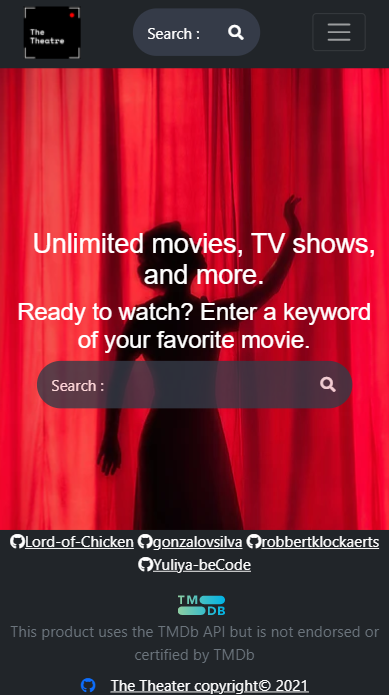

### Welcome to the webpage of The Theatre !

# Who

Our Project Team consists of

* Backend Developer - [@Lord-of-Chicken](https://github.com/Lord-of-Chicken)
* Backend Developer -[@gonzalovsilva](https://github.com/gonzalovsilva)
* Frontend Developer - [@robbertklockaerts](https://github.com/robbertklockaerts)
* Project Manager - [@Yuliya-beCode](https://github.com/Yuliya-beCode)

Tasks allocation

| Gonçalo Silva| Gael Layeux | Robbert Klockaerts |  Yuliya Bochkovskaya|
|:-----------:|:-----------:|:-----------:| :-----------:|   
| right to comment on the content  | a session system: registration, connection / disconnection. | right to comment on the content | General administration of the project/Figma style |  
| Include a search bar and sort by filters| php footer/header include | admin dashboard | php insert video into iframe |
| page or section that displays the top movies with the movie db API| Back office for user and comment management (CRUD) | login form css |  footer/header templates|
| General administration of the project drafting search flow chart| General administration of the project | General administration of the project|  register form css|

If you have any questions in regards to our project, please do not hesitate to contact us directly on GitHub. Our contact details are mentioned above. 

# What

The Theatre is a streaming website created in html / css, javascript and php.

* We got inspired by Netflix, Amazon Prime Video and other Popcorn Time ... Our goal was to display a catalog of
movies. 

* We well spotted  the similarities between these platforms (navbar, header, search tool, different categories of videos…) 

Please find here below the UX prototype of our website at the first stage of its creation

[UX-Prototype of our website ](https://www.figma.com/proto/LZLTLgveLvyu8aBJbc3u1G/The-Theater?node-id=66%3A0&scaling=scale-down&page-id=0%3A1)

# How

- A session system: registration, connection / disconnection.
- Different rights: registrants have the right to comment on the content. You can add other rights depending on the different types of users.
- Include a search bar and sort by filters.
- The code is secured.
- Back office for user and comment management (CRUD).
- The filter function that displays the top movies with the movie db API is enabled. 

# Why

# When

# Evaluation criterias -> self check

- [x] We have realized all must-have features.
- [] There is a published GitHub page available.
- [] The code is well indented and commented.
- [] The readme is clean and complete.
- [] At least one Nice-to-have features is ok.
- [] The HTML and CSS pass the W3C Validation tool.
- [] The lighthouse test scores 90 at least on Performance, Best Practices, Accessibility and SEO.
- [] The code is well indented and commented.

